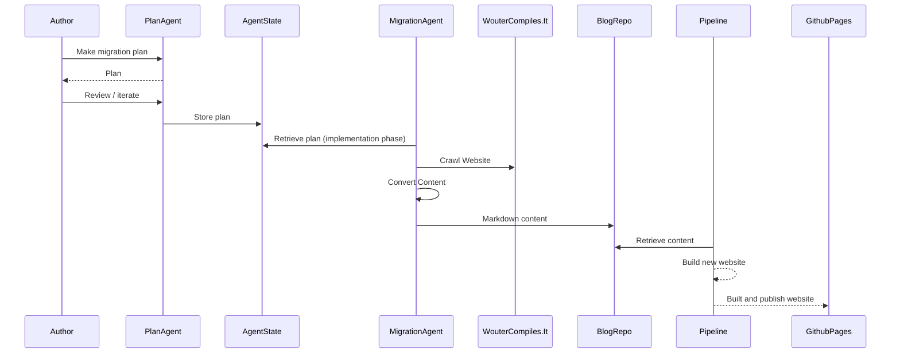

Running WordPress for a personal blog always felt like overkill. My site is mostly static — I write a new post, add some metadata, and hit publish. Yet there I was, managing a full CMS, keeping plugins up to date, and paying for hosting that did far more than I ever needed. One morning it struck me: could a free, Git-based hosting service like GitHub Pages give my readers the exact same result with far less overhead? And could Jekyll — a simple static site generator — replace the whole WordPress setup?


## Why GitHub Pages?

I came across [GitHub Pages](https://docs.github.com/en/pages) a couple of times before. It offers a hosting service for static websites. You provide the source code for the website yourself, whether you write the HTML directly or generate it through a build process. It looked like exactly what I needed.

- It offers a free hosting model.
- The site is maintained using a Git-based workflow. You update the repository, the website is updated accordingly.
- No server or CMS maintenance — the Git repository is the only thing to maintain.

Would the migration be straightforward? Would it be lighter and cheaper? And how would I preserve all my existing content in the process?

## Tools and environment

This post covers migrating a self-hosted WordPress blog to GitHub Pages using the following tools and environment:

- **[Jekyll](https://jekyllrb.com/)** as the static site generator, with the Minima theme
- **GitHub Actions** for automated builds and deployments
- **GitHub Copilot** (agent mode in Visual Studio Code) to drive the migration
- **Visual Studio Code** as the editing and authoring environment

No manual HTML editing or custom plugins were involved. Everything runs on free-tier GitHub infrastructure.

## The migration plan

In a customer production scenario, the migration would normally be a very technical and deterministic exercise. An existing CMS would have a database containing all the articles and content. A process or pipeline would be sketched out to extract the data and funnel it into the new format for GitHub Pages. It would be thoroughly tested and signed off before switching to the new hosting service and going live.

In my case, it is my own blog, so I can do a bit more experimenting and take a bit more risk when it comes to the deterministic side of things.
**I want to use GitHub Copilot to do the migration.**
I don't mean building a deterministic pipeline with Copilot. I mean Copilot itself crawling my existing website, gathering the data and building up the Git repository locally — in a sense, reverse-engineering my blog.

In the diagram below, you can see my broad idea for the migration.



*Sequence diagram of the GitHub Copilot-driven migration workflow: from crawling the existing WordPress blog, through content conversion, to building and publishing on GitHub Pages.*

## Setting up the repository

I had no experience with GitHub Pages, and I had no intention of reading up on it much beforehand. I gave Copilot the assignment to come up with a plan for a Git-based blog website that can be maintained as code.
It immediately made the suggestion to set up Jekyll as a website generator that uses Markdown files as source input.
It gives me the flexibility of content management, but all content can be edited from within Visual Studio Code, for example.
All blog posts are placed in a `_posts` directory like source code.


When the website is built, each post in the folder is wrapped with HTML so that it is rendered properly in the end user's browser.

The design and technical structure of the website was built by Copilot itself. I took a step back and purely sat reviewing code suggestion after code suggestion.
Not only was I steering Copilot to be more aligned with my requirements, but I was also learning about Jekyll and GitHub Pages along the way. While the agent was running, I was reading up on the documentation to verify that my agent produced not only a working website, but also a correct one from a quality perspective.

## Migrating content

Now that I had a landing zone in place for the content to be migrated to, I needed to make a detailed migration plan for the implementation agent to perform the migration.
I switched to the `Plan Agent` and explained what I described in [the migration plan](#the-migration-plan).
Once a plan was in place I just gave the go-ahead. Remember, the new blog would be initially published in parallel to the original blog. So if the migration failed, I would simply adjust the plan and retry over and over.

The first step was to let the agent crawl through the live website. Here I was impressed by the agent to go through all the WordPress HTML clutter and extract the actual content from it.
I went from an average of 1000 HTML lines, to just under 200 in the new blog.
An end-user won't notice this, but me as a software engineer would rather see fewer lines of code to achieve the same thing.
Migrating inline images was a hurdle that kept tripping the agent.
With large blocks of PowerShell it was trying to download the images and place them back into the new Markdown files with the rest of the textual content.
Yet often this didn't work out and we had to start over.
In the end, I did this part manually.

Most of the time the agent was running in the background while I was preparing follow-up requests. I actually had the feeling of collaborating instead of directing.

## Configuring GitHub Actions

Once the content was migrated, I could start on automating the publication of the new blog website. The `main` branch should reflect the live website.

Every push to `main` triggers a two-job pipeline: one job builds the Jekyll site, the other deploys the resulting artifact to GitHub Pages.

```yaml
name: Deploy Jekyll to GitHub Pages

on:
  push:
    branches:
      - main
  workflow_dispatch:

permissions:
  contents: read
  pages: write
  id-token: write

concurrency:
  group: "pages"
  cancel-in-progress: false

jobs:
  build:
    runs-on: ubuntu-latest
    steps:
      - name: Checkout
        uses: actions/checkout@v4

      - name: Setup Ruby
        uses: ruby/setup-ruby@v1
        with:
          ruby-version: "3.3"
          bundler-cache: true

      - name: Setup Pages
        uses: actions/configure-pages@v5

      - name: Build with Jekyll
        run: bundle exec jekyll build
        env:
          JEKYLL_ENV: production

      - name: Upload artifact
        uses: actions/upload-pages-artifact@v3

  deploy:
    environment:
      name: github-pages
      url: ${{ steps.deployment.outputs.page_url }}
    runs-on: ubuntu-latest
    needs: build
    steps:
      - name: Deploy to GitHub Pages
        id: deployment
        uses: actions/deploy-pages@v4
```

The `build` job checks out the repository, installs the correct Ruby version (with Bundler caching to keep runs fast), and calls `bundle exec jekyll build` with `JEKYLL_ENV=production`. The output is uploaded as a Pages artifact. The separate `deploy` job then picks up that artifact and publishes it using the official `actions/deploy-pages` action. The two-job split is intentional: GitHub Pages requires the deployment to run in a dedicated environment so it can issue the short-lived OIDC token needed to publish.

## Challenges and surprises

### Hallucinations

As with any AI adventure, of course in this case I saw the LLM compensating for unexpected situations.
I saw my original content being rewritten for example during the migration.
I didn't try to prevent this necessarily, apart from creating plans upfront and reviewing them.
Manually reviewing the content was always needed to build up confidence in the migration.

### Agents on strike

More than once I encountered losing the attention of an agent at work. No more chat updates were coming in, and I had to repeat my last question in order to get the processing moving again.
The migration was a long running process, perhaps I hit an internal timeout within the Visual Studio Code chat window.

## Migration result

Once the first version of the website was running on GitHub Pages I was impressed by how quickly I went from an initial idea to running software. I have a new blog website with working navigation, SEO, and my original content preserved. The full source code is available on [GitHub](https://github.com/wouterfennis/blog).
You are reading this blog post from the new website right now!

## Conclusion

I'm genuinely impressed by the power of GitHub Copilot in an experiment like this. Within two days I was able to migrate my blog towards a new hosting provider, a new CMS (blog as code) solution and a new workflow of writing blog posts more effectively with the help of Copilot. I would recommend letting Copilot build a deterministic migration pipeline in normal circumstances, but if the project allows it — give it a try yourself.

## References

- [GitHub Pages documentation](https://docs.github.com/en/pages)
- [Jekyll documentation](https://jekyllrb.com/docs/)
- [Source code of this blog](https://github.com/wouterfennis/blog)
